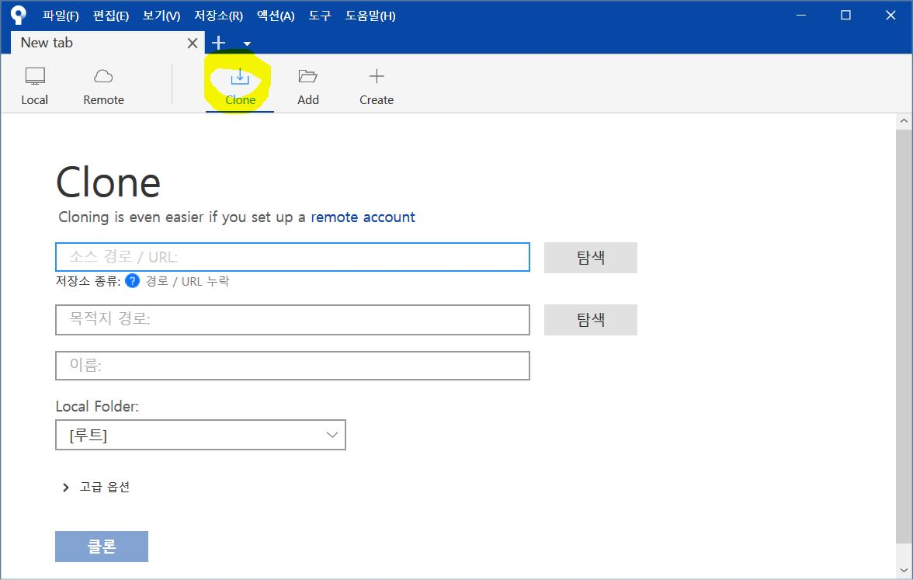
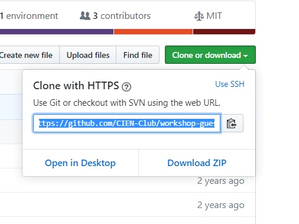
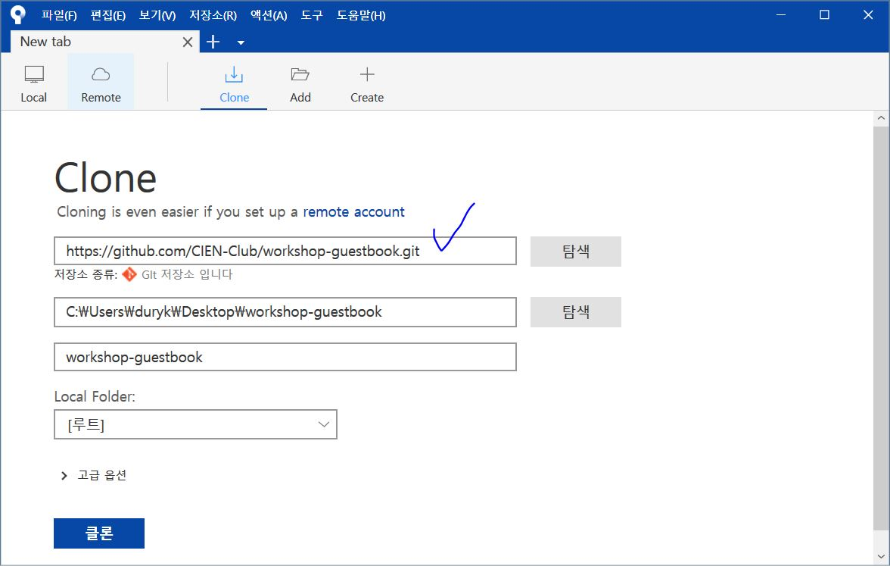
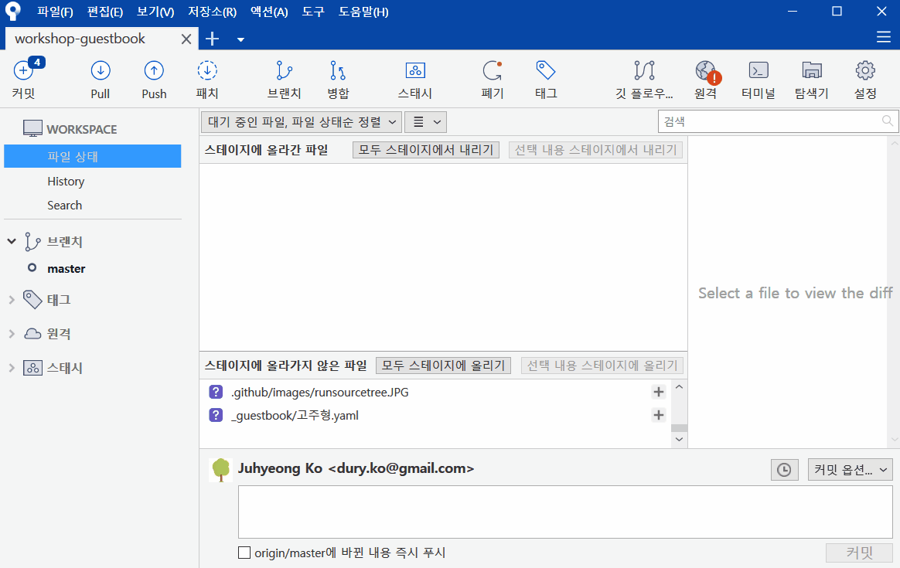
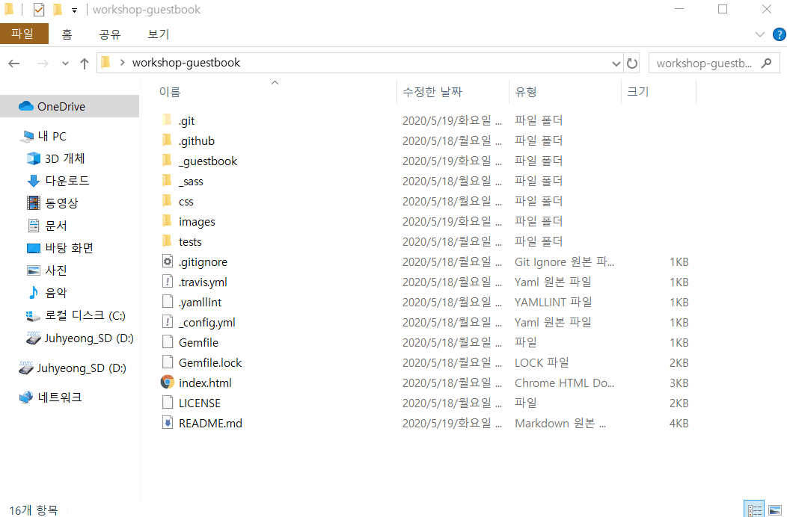
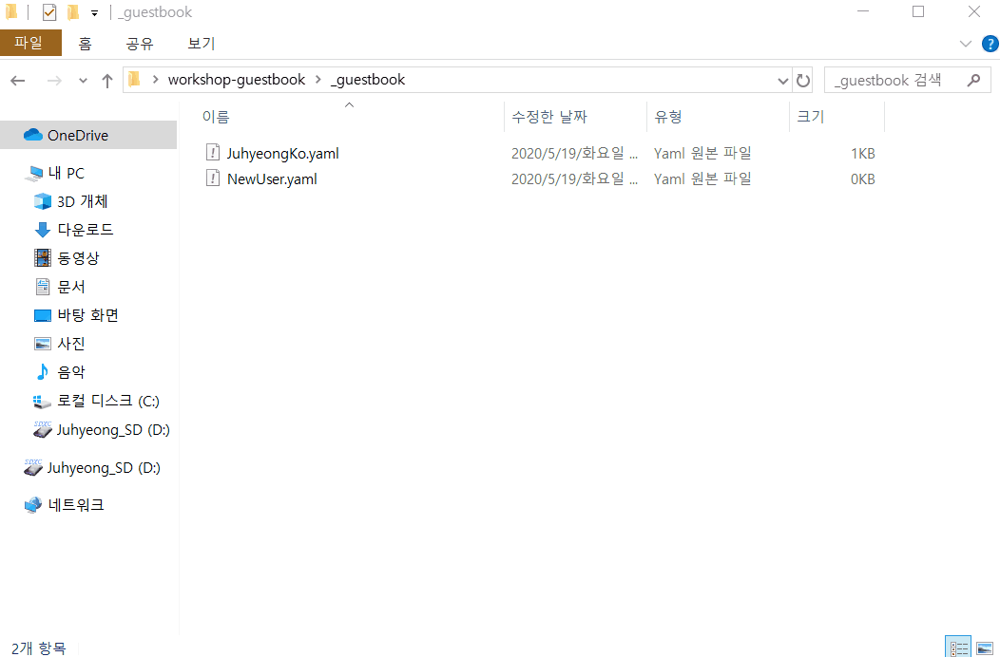
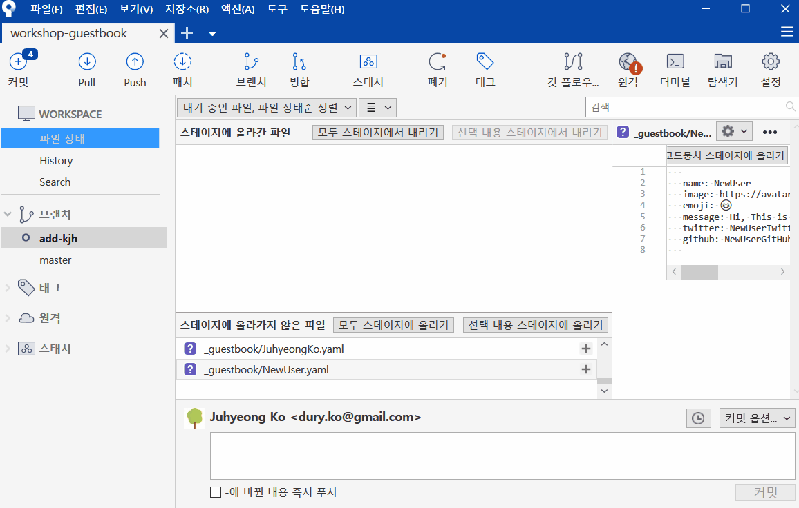
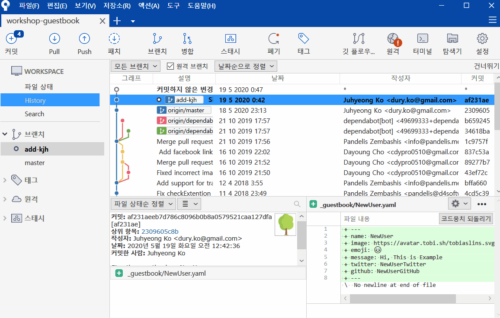

# 방명록 남기기

Git을 이용해 여러분의 방명록을 남기는 방법을 안내합니다.

---

## 1. 관리자에게 GitHub 계정명 보내기

먼저, 저장소 관리자에게 GitHub 사용자명을 보내주세요.
Public 원격 저장소는 Clone은 누구나 가능하지만, Push는 초대 받은 사용자만 가능합니다.
계정명을 보내면 Push 권한을 드릴게요.

---

## 2. SourceTree 실행하기

초대를 수락하셨다면 이제 SourceTree로 작업할 수 있습니다.



---

## 3. 저장소 Clone 하기

SourceTree에서 이 저장소를 Clone 해주세요.




---

## 4. Branch 생성하기

안정적인 main과 별도로 개발할 수 있도록 새 Branch를 만듭니다.
Branch 이름은 어떤 작업을 하는지 알 수 있게 지정해주세요.



---

## 5. 방명록 작성하기

복제한 저장소의 `/_guestbook` 폴더로 이동한 후, 새로운 파일을 생성합니다.
파일 이름은 **내이름.yaml**이어야 합니다 (확장자가 .yaml.txt가 아니어야 해요).
아래 예시 형식을 참고하여 내용을 작성하세요.
*name*과 _image_ 필드 외에 나머지는 원하시는 대로 작성해도 괜찮습니다.

yaml 파일 예시

```yaml
---
name: 고주형
image: https://avatar.tobi.sh/tobiaslins.svg?text=KJH
emoji: 🌴
message: 유니티 수업 잘따라오고 계시나요? ㅎㅎ
twitter: IamGroooooot
github: IamGroooooot
facebook: IamGroooooot
instagram: i-am-groooooot
web: coding-groot.tistory.com
---
```

- 만약 개인 이미지를 설정하지 않으시려면, image 링크 끝에 영어 이니셜(`?text=KJH`)을 추가해주세요.
- 이모지는 [emojipedia.org](https://emojipedia.org/)에서 쉽게 찾을 수 있으며, 윈도우에서는 `윈도우키`+.`를 눌러 입력할 수 있습니다.
- `twitter`, `github`, `facebook`, `instagram`, `web` 항목은 해당 계정이나 사이트가 있다면 채워주세요.




---

## 6. Commit 하기

자신의 Branch에 방명록 파일을 추가하고, 간단하고 명료한 메시지로 Commit 해주세요.



---

## 7. Push 하기

작업이 완료되면, main이 아닌 자신이 생성한 Branch로 변경사항을 Push합니다.



---

## 8. 성공! Pull Request 보내기

이제 관리자(고주형)에게 Pull Request를 보내기만 하면 됩니다.
관리자가 Branch를 Merge하면 여러분의 방명록이 페이지에 표시됩니다.

즐겁게 작업하세요!
